<div align="right">
  <a href="./README.md">🇧🇷 Português</a> &nbsp;•&nbsp; 🇺🇸 <b>English</b>
</div>

<div align="center">



</div>

<div align="center">


</div>

<div align="center">

[](#-how-does-it-work)
[](#-how-does-it-work)
[](#-how-does-it-work)
[](#-static-deploy)

</div>

---

**Reading Progress Engine** is not a reading app. It's not a social network. It's not a gamifier.
It is a **structured data system** to transform your reading habit into a searchable, versionable, and personal history — stored entirely as JSON files in a GitHub repository that **you** control.
No database. No accounts. No mandatory APIs. Just structured data, versioned by Git.

<div align="center">

<table>
  <tr>
    <td align="center" valign="middle" width="80">
      
    </td>
    <td>
      <strong>Reading Progress Engine</strong><br/>
      <small>Reading tracking system based on JSON files under your total control.</small><br/>
      <a href="https://pedrolabre.github.io/reading-progress-engine" target="_blank">
        
      </a>
    </td>
  </tr>
</table>

</div>

---

## 📌 Table of Contents

1. [🎯 Why does it exist?](#-why-does-it-exist)
2. [⚙️ How does it work?](#-how-does-it-work)
3. [📁 Project Structure](#-project-structure)
4. [🚀 Static Deploy](#-static-deploy)
5. [🧠 Design Decisions](#-design-decisions)
6. [✅ Status](#-status)

---

## 🎯 Why does it exist?

This project was born out of a personal need: **the concern for recording**.

It's not "I want to read more". It's not "I want to track streaks". It is: *"I want a reliable and organized way to document my reading evolution over time."*

The idea started with a simple scenario:

> *I have a 700-page book. I've read 200. The chapter starts on page 203. I want to record my progress — not just how many pages I read, but my evolution through the book, chapter by chapter, session by session.*

From this, a broader vision emerged:

- What if, a year from now, I could query: *"all the fantasy books I read in 2026"*?
- What if I could see: *"how many pages I read in March"*?
- What if I could filter: *"paused books"*, *"most read authors"*, *"completed series"*?
- And all this **without a database** — just by reading JSON files?

That is what the Reading Progress Engine is.

---

## ⚙️ How does it work?

### 🧱 Data layer

Reading data is organized as JSON files within the repository:

| Concept | Description |
|---|---|
| **Book** | Metadata of a book — title, author, total pages, category, genres |
| **Strike** | A reading session — date, pages read, chapter, notes |
| **Category** | Classification system to organize the library |
| **Library** | Aggregated view of all registered books |

<details>
<summary><strong>Minimal example (required fields)</strong></summary>

```json
{
  "title": "Dune",
  "author": "Frank Herbert",
  "totalPages": 412,
  "currentPage": 0,
  "status": "to-read",
  "category": "science-fiction"
}
```

</details>

<details>
<summary><strong>Full example (all fields)</strong></summary>

```json
{
  "title": "The Way of Kings",
  "author": "Brandon Sanderson",
  "totalPages": 1007,
  "currentPage": 203,
  "status": "reading",
  "category": "fantasy",
  "genres": ["epic-fantasy", "fiction"],
  "language": "en",
  "startDate": "2026-02-10",
  "endDate": null,
  "isbn": "978-0-7653-2635-5",
  "publisher": "Tor Books",
  "year": 2010,
  "notes": "Comecei nas férias. Capítulo 1 começa na página 1, Parte 2 na página 203.",
  "tags": ["favorites", "series-cosmere"],
  "coverUrl": null
}
```

</details>

<details>
<summary><strong>Minimal Strike example (required fields)</strong></summary>

```json
{
  "book": "dune",
  "date": "2026-03-16",
  "startPage": 100,
  "endPage": 120,
  "pagesRead": 20
}
```

</details>

<details>
<summary><strong>Full Strike example (all fields)</strong></summary>

```json
{
  "book": "the-way-of-kings",
  "date": "2026-03-15",
  "startPage": 203,
  "endPage": 245,
  "pagesRead": 42,
  "chapter": "Chapter 12 - Unity",
  "duration": 65,
  "notes": "Capítulo intenso. A visão do Dalinar foi inesperada."
}
```

</details>

### 💻 Web application

The application serves two purposes:

1. **Data generation** — Forms that produce valid JSON files, with the correct name, path, and structure. You fill out the form, the app generates the file, and you commit it manually.
2. **Data visualization** — The app reads all JSON files from the repository and builds an interactive visual library. Sorting, filtering, and exploring are the responsibility of the application — they are not stored in the data files.

### ✍️ The commit is manual

This is intentional. The web application **does not** push to GitHub. It generates files. You make the commit. This keeps the flow simple, transparent, and under your control.

---

## 📁 Project Structure

```text
reading-progress-engine/
|-- .github/
|   `-- workflows/
|       |-- deploy-pages.yml
|       `-- validate.yml
|-- README.md
|-- data/
|   |-- books/
|   |-- categories/
|   |-- strikes/
|   `-- library.json
|-- examples/
|-- schemas/
|-- scripts/
`-- web/
    |-- index.html
    |-- package.json
    |-- package-lock.json
    |-- vite.config.js
    `-- src/
        |-- App.jsx
        |-- components/
        |   |-- BookCard.jsx
        |   |-- BookDetail.jsx
        |   |-- BookTimeline.jsx
        |   |-- CopyButton.jsx
        |   |-- DownloadButton.jsx
        |   |-- FileInfo.jsx
        |   |-- JsonPreview.jsx
        |   |-- LibraryFilterControls.jsx
        |   |-- LibraryGrid.jsx
        |   `-- LibrarySortControls.jsx
        |-- pages/
        |   |-- BookDetailPage.jsx
        |   |-- BookFormPage.jsx
        |   |-- CategoryFormPage.jsx
        |   `-- StrikeFormPage.jsx
        |-- styles/
        `-- utils/
            |-- bookDetail.js
            |-- bookForm.js
            |-- categoryForm.js
            |-- clipboard.js
            |-- download.js
            |-- filePaths.js
            |-- jsonGenerator.js
            |-- libraryDiscovery.js
            |-- libraryFilters.js
            |-- libraryLoader.js
            |-- libraryMetrics.js
            |-- librarySorting.js
            |-- slugify.js
            `-- strikeForm.js
```

> The structure grows along with the code. Everything that is added appears here.

---

## 🚀 Static Deploy

The MVP is published as a static SPA on GitHub Pages via GitHub Actions.

- `.github/workflows/validate.yml` validates data and builds on `push` and `pull_request`.
- `.github/workflows/deploy-pages.yml` runs on `push` to `main` and on manual trigger.
- The deploy uses Node `20.19.0`, validates the data, regenerates `data/library.json`, fails if the generated index is different, checks JavaScript syntax, and builds `web/`.
- The Pages build uses the base path `/reading-progress-engine/`, compatible with project GitHub Pages.
- The published artifact is only `web/dist`.

For the deploy to run on GitHub, configure Pages to use **GitHub Actions** as the publishing source in the repository settings.

---

## 🧠 Design Decisions

Every technical choice in this project is guided by the problem, not by trends:

| Decision | Justification |
|---|---|
| **JSON instead of database** | Files are human-readable, versionable, portable, and require no infrastructure |
| **Schema-first development** | The data format is defined before any interface — avoids rework |
| **Manual commits** | Keeps the user in total control; no magic, no surprises |
| **React + Vite** | Componentization, reactive state, routing. The build generates static files that run anywhere |
| **No mandatory external API** | Core functionality works offline, forever |
| **Sorting/filters in the app** | Data files remain clean and reusable by any tool |

---

## ✅ Status

MVP ready for static deploy: data, generators, library, detail, automatic JSON discovery, validation CI, and GitHub Pages workflow are configured without a backend, database, login, or mandatory external API.

---

<div align="center">
Developed by <b>Pedro Labre</b>
</div>
